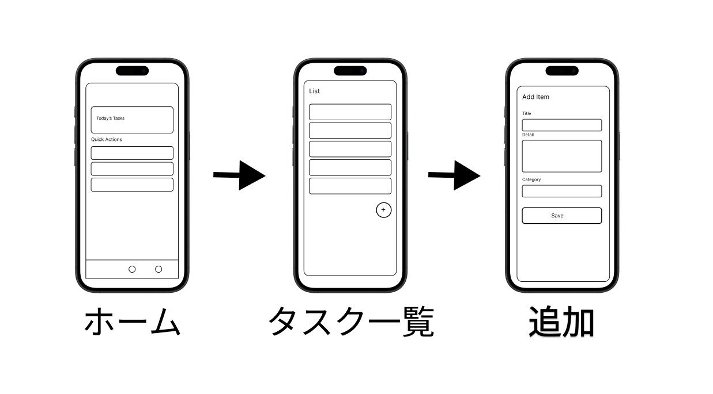

## {background-color="white" .center .break-slide}

::: {.break-title}
アプリの「設計図」を作る
:::

## いきなりコードを書いてはいけない

- 優先順位が決まった（[ペイオフマトリクス](payoff-matrix.qmd)）——次にやるのは実装ではなく **画面の設計**
- 建築と同じ：家をいきなり建て始める大工はいない。==まず設計図==
   - 画面の設計図のことを **ワイヤーフレーム**（[wireframe]{.en}）と呼ぶ
   - 「針金（wire）の枠（frame）」— 線と枠だけの、**飾りのない骨組み図**

::: {.callout-tip}
## なぜ白黒の骨組みだけ？
色やアイコンを作り込むと「きれいかどうか」の話になってしまう。
骨組みだけなら、==何をどこに置くか== という **構造の議論** に集中できる
:::

## ワイヤーフレームは紙でも描ける

::: {.fig-cite src="imgs/figma/paper_wireframe.jpg" height="380px"}

::: {.cite}
写真: Intel Free Press, CC BY-SA 2.0, via Wikimedia Commons
:::

:::

- 最初の1枚は **紙とペンで十分**。プロも紙のスケッチから始める
- ただし紙には弱点がある — ==修正・共有・使い回しがしにくい==
   - そこで登場するのが専用ツール

## Figma：画面設計の定番ツール

- **Figma**（フィグマ）= アプリ・Webサイトの画面を **設計 → 共有 → 改善 → 試作** まで一気にできるデザインツール
   - ブラウザで動く（インストール不要）・個人利用は無料枠で十分
   - Google Docs のように ==複数人で同時編集できる== のが最大の特徴
- 実際の開発現場での使われ方
   - 一般に使われるサービスの **画面設計**（メッセージアプリの新機能、フリマアプリの出品フロー…）
   - 企画段階の **アイデア検証** — コードを書かずに画面遷移まで試せる
   - エンジニア・デザイナー・企画が **1つのFigmaファイルを見ながら会話する**

## Figmaを使う職種

| 職種 | Figmaで何をする？ |
|----|----|
| **UI/UXデザイナー** | 画面レイアウト・色・動きの設計 |
| **エンジニア**（フロント／モバイル） | Figmaを見て実装。仕様の確認 |
| **PM**（プロダクトマネージャー） | 画面を使って仕様を説明 |
| **企画・マーケティング** | 新サービス案のプロトタイプ作成 |
| **データ・研究開発** | 実験ツールの画面や説明資料の作成 |

- 「デザイナー専用」ではない — ==画面で会話するすべての職種== の共通言語

## 今日使う基本操作は5つだけ

| キー | 操作 |
|---|---|
| **F** | [Frame]{.en}（画面の枠）を置く |
| **R** | 四角形（ボタンやカード） |
| **T** | テキスト（タイトルやラベル） |
| **Shift + A** | [Auto Layout]{.en}（自動整列） |
| **Alt + ドラッグ** | コピー |

::: {.callout-note}
## 迷ったら左上のツールバー
キーを忘れてもツールバーから選べる。まずは F・R・T の3つで大半の画面が作れる
:::

## **演習** まず1画面作る {.badge-practice}

::: {.prompt}
「今日の予定を見る画面（Home）」を Figma で1画面作れ。
:::

0. [figma.com](https://www.figma.com/) にログインして新規デザインファイルを作成
1. **F** キー → 右パネルから iPhone サイズの Frame を置く
2. 左上に **T** で「Home」とタイトルを置く
3. **R** の四角形でカード（Today's Tasks）
4. 四角を3つ並べてクイックメニュー（Quick Actions）

::: {.callout-tip}
## きれいさは要らない
グレーの四角と黒い文字だけでよい。==置く・並べる・名前を付ける== が今日の全部
:::

## **演習** 3画面のワイヤーフレーム {.badge-practice}

{width="78%" fig-align="center"}

::: {.prompt}
ホーム → タスク一覧 → 追加フォーム の3画面ワイヤーフレームを作れ（上図がゴールの目安）。
:::

0. キャンバスに iPhone Frame を横並びで3つ置く
1. **ホーム** — タイトル・カード・クイックメニュー・下タブ（◯3つ）
2. **タスク一覧** — タイトル・リストアイテム5つ・右下に「＋」ボタン
3. **追加フォーム** — Title・Detail・Category の入力欄と Save ボタン

## よくある画面パターン

| 系統 | 定番の部品 |
|----|----|
| **ホーム系** | カード表示・サマリー情報・クイックリンク |
| **一覧系**（[List]{.en}） | タイトル + サブ情報、「＞」で詳細へ |
| **詳細系**（[Detail]{.en}） | タイトル・説明、編集／削除ボタン |
| **入力系**（[Form]{.en}） | テキスト欄・日付選択・Save / Cancel |
| **ナビゲーション系** | 下タブ（[Tab bar]{.en}）・ハンバーガーメニュー・「＋」の丸ボタン（[FAB]{.en}） |

- 世の中のアプリは、ほぼこのパターンの ==組み合わせ== でできている
   - 手元のスマホのアプリを開いて、どのパターンか **分解して見る** クセをつける

## **演習** 自分のアプリの画面を作る {.badge-practice}

::: {.prompt}
ペイオフマトリクスで「すぐやるべき」に選んだ自分のアプリ案について、3画面以上のワイヤーフレームを作り、Prototype機能で画面をつなげ。
:::

0. 必要な画面を **3つだけ** 決める（欲張らない — 増やすのはいつでもできる）
1. 前ページのUIパターンから部品を選ぶ
2. 各画面に配置
3. Prototype タブでボタンと画面を矢印でつなぐ → 再生ボタンで **動くアプリのように試す**

::: {.callout-important}
## ここで作った3画面が実装の設計図になる
この後の [NiceGUI](nicegui.qmd) では、このワイヤーフレームを **本物のコード** にしていく
:::
