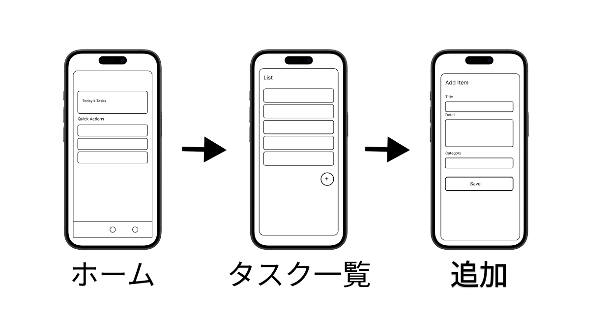

## {background-color="white" .center .break-slide}

::: {.break-title}
ワイヤーフレーム
:::

## 画面の構成を決める

- [ペイオフマトリクス](payoff-matrix.qmd) で選んだ案について、必要な画面と部品を決める
- **ワイヤーフレーム**（[wireframe]{.en}）：線や枠で、画面の構成・情報の配置を表す図

::: {.callout-tip}
## 最初に決めること
必要な情報、ボタンの位置、画面間の移動を確認する。色やアイコンの細部はあとで調整する
:::

## ワイヤーフレームは紙でも描ける

::: {.fig-cite src="imgs/figma/paper_wireframe.jpg" height="380px"}

::: {.cite}
写真: Intel Free Press, CC BY-SA 2.0, via Wikimedia Commons
:::

:::

::: {.caption-note}
紙とペンで画面を描いた例。デジタルのツールでは、複製・修正・共有がしやすい
:::

## Figma：画面設計のツール

- **Figma**（フィグマ）は、アプリ・Webサイトの画面を設計するツール
   - ブラウザで編集できる
   - 複数人で同じファイルを同時編集できる
- 実際の開発現場での使われ方
   - 一般に使われるサービスの **画面設計**（メッセージアプリの新機能、フリマアプリの出品フロー…）
   - 企画段階の **アイデア検証**（コードを書かずに画面遷移を試す）
   - エンジニア・デザイナー・企画が **1つのFigmaファイルを見ながら会話する**

## Figmaを使う職種

| 職種 | Figmaで何をする？ |
|----|----|
| **UI/UXデザイナー** | 画面レイアウト・色・動きの設計 |
| **エンジニア**（フロント／モバイル） | Figmaを見て実装。仕様の確認 |
| **PM**（プロダクトマネージャー） | 画面を使って仕様を説明 |
| **企画・マーケティング** | 新サービス案のプロトタイプ作成 |
| **データ・研究開発** | 実験ツールの画面や説明資料の作成 |

::: {.caption-note}
画面を見ながら、実装する機能や使い方を共有する
:::

## 基本操作

| キー | 操作 |
|---|---|
| **F** | [Frame]{.en}（画面の枠）を置く |
| **R** | 四角形（ボタンやカード） |
| **T** | テキスト（タイトルやラベル） |
| **Shift + A** | [Auto Layout]{.en}（自動整列） |
| **Alt + ドラッグ** | コピー |

::: {.callout-note}
## ツールバーから選ぶ
Frame・四角形・テキストは [画面下のツールバー](https://help.figma.com/hc/en-us/articles/360041064174-Access-design-tools-from-the-toolbar) からも選べる。[Auto Layout](https://help.figma.com/hc/en-us/articles/360040451373-Guide-to-auto-layout) は対象を選択して右サイドバーから追加できる
:::

## **演習** まず1画面作る {.badge-practice}

::: {.prompt}
「今日の予定を見る画面（Home）」を Figma で1画面作れ。
:::

0. [figma.com](https://www.figma.com/) にログインして新規デザインファイルを作成
1. **F** キーで、右パネルから iPhone サイズの Frame を配置
2. **T** で「Home」のタイトルを画面左上に配置
3. **R** の四角形でカード（Today's Tasks）
4. 四角を3つ並べてクイックメニュー（Quick Actions）

::: {.callout-tip}
## 部品の用途を示す
グレーの四角と黒い文字でよい。カードやメニューには、何を表示する場所か分かるラベルを付ける
:::

## 例：3画面のワイヤーフレーム

::: {.fig width="78%"}

:::

## **演習** 3画面のワイヤーフレーム {.badge-practice}

::: {.prompt}
ホーム → タスク一覧 → 追加フォーム の3画面ワイヤーフレームを作れ（前ページの図を目安にすること）。
:::

0. キャンバスに iPhone Frame を横並びで3つ配置
1. **ホーム**：タイトル・カード・クイックメニュー・下タブ（◯3つ）を配置
2. **タスク一覧**：タイトル・リストアイテム5つ・右下の「＋」ボタンを配置
3. **追加フォーム**：Title・Detail・Category の入力欄と Save ボタンを配置

## よくある画面パターン

| 系統 | 定番の部品 |
|----|----|
| **ホーム系** | カード表示・サマリー情報・クイックリンク |
| **一覧系**（[List]{.en}） | タイトル + サブ情報、「＞」で詳細へ |
| **詳細系**（[Detail]{.en}） | タイトル・説明、編集／削除ボタン |
| **入力系**（[Form]{.en}） | テキスト欄・日付選択・Save / Cancel |
| **ナビゲーション系** | 下タブ（[Tab bar]{.en}）・ハンバーガーメニュー・操作用の丸ボタン（[FAB: Floating Action Button]{.en}） |

::: {.callout-tip}
## 手元のアプリと比較する
スマホのアプリを1つ開き、ホーム・一覧・詳細・入力のどの画面があるか確認する
:::

## **演習** 自分のアプリの画面を作る {.badge-practice}

::: {.prompt}
ペイオフマトリクスで「すぐやるべき」に選んだ自分のアプリ案について、3画面以上のワイヤーフレームを作り、Prototype機能で画面をつなげ。
:::

0. 最初に作る画面を **3つ** 選定
1. 前ページのUIパターンから部品を選択
2. 各画面に配置
3. Prototype タブでボタンと遷移先の画面を接続し、再生ボタンで動作確認

::: {.callout-important}
## 設計と実装
このワイヤーフレームを [最終課題](final-project.qmd) の設計に使う。[NiceGUI](nicegui.qmd) の部品で配置を作り、データの取得や入力処理を追加する
:::
