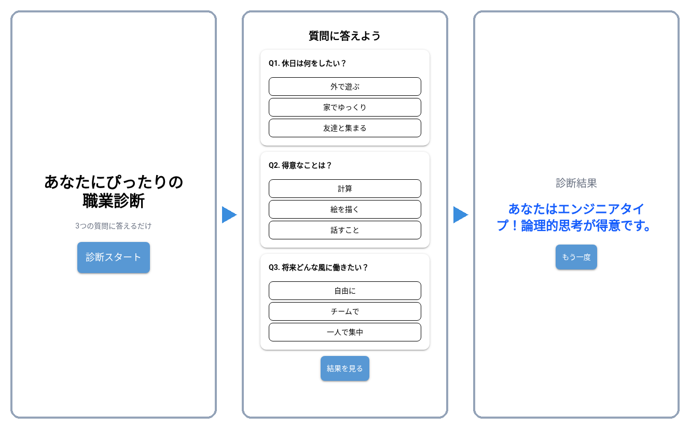

## 後期のゴール：これを自分で作る

{width="72%"}

- 質問に答えると結果が出る、**Webブラウザで動く診断アプリ**
   - 画面はPython（NiceGUI）、データは自作API、そして ==企画は自分==
- 最終課題で、これを **企画 → 設計 → 実装** まで全部自分の手で作る
   - そのための道具を、ここから1つずつ集めていく
   - 最初の道具が今日の **発想法** — 「何を作るか」は才能ではなく ==テクニックで出せる==


## {background-color="white" .center .break-slide}

::: {.break-title}
アイデアを広げる3つの発想法
:::


## 発散と収束：アイデアづくりの2段階

- アイデアづくりは ==2つのモード== を行き来する
   - **発散思考**（[divergent thinking]{.en}）— 考えを **広げる**。思いつくまま出して、まだ形にしない
   - **収束思考**（[convergent thinking]{.en}）— 出したものを **整理して絞る**。まとめて実行案にする

```{.d2 sketch="true" width="100%"}
direction: right
T: テーマ {style.fill: "#fff3e0"}
D: 発散\n広げる\n量を出す {style.fill: "#e3f2fd"}
C: 収束\n整理する\n絞る {style.fill: "#e8f5e9"}
A: 実行案 {style.fill: "#fce4ec"}
T -> D: ブレスト\n635法
D -> C: KJ法\nマップ
C -> A: ペイオフ\nマトリクス
```

::: {.callout-important}
## 鉄則：出すときは出すだけ
発散の最中に ==評価・批判をしない==。「広げる」と「絞る」を **同時にやると両方失敗する**
:::


## なぜ「量」なのか

- 「いいアイデアを1個出そう」とすると、**手が止まる**
   - 頭の中で出す→自分で却下、の無限ループ
- 発想法はどれも、==とにかく数を出させる== ための **仕掛け**
   - 量の中から、あとで質を **選べばいい**
- 今日の3つの発想法は「数を出す仕掛け」がそれぞれ違う

| 方法 | 仕掛け |
|---|---|
| ブレインストーミング | **会話** の連鎖反応 |
| クレイジー8 | **時間制限** で追い込む |
| 635法 | **強制ローテーション** で全員から集める |


## {background-color="white" .center .break-slide}

::: {.break-title}
ブレインストーミング
:::


## ブレインストーミング（Brainstorming）

::: {.fig-cite src="imgs/ideation/brainstorming_workshop.jpg" height="380px"}

::: {.cite}
写真: Jan Dittrich (WMDE), CC BY 4.0, via Wikimedia Commons
:::

:::

- みんなで集まって、テーマについて **自由にアイデアを出し合う** 方法
- 1950年代、アメリカの広告会社の重役 **アレックス・F・オズボーン**（Alex F. Osborn、1888–1966）が考案
   - オズボーンは [チェックリスト法](scamper.qmd) の生みの親でもある
- 日本では略して **ブレスト** と呼ばれる


## ブレストの4つのルール

1. **批判厳禁** — どんな意見でも受け入れる
2. **自由奔放** — ふざけたアイデアも歓迎
3. **質より量** — たくさん出すことがいちばん大事
4. **便乗歓迎** — 人の意見に乗っかって新しい案を作る

::: {.callout-tip}
## なぜ「批判厳禁」が最初のルールか
一度でも批判されると、全員が ==「安全な案」しか言わなくなる==。
場の心理的安全性が発想の量を決める
:::


## ブレストの進め方

0. 司会（**ファシリテーター**、[facilitator]{.en}）がテーマを発表
1. 思いついた人からどんどん口に出す
2. 出た案は **すべて書き留める**（ホワイトボード・付箋）
3. ある程度出たら、整理・分類へ（→ 収束技法）

- 得意・不得意がはっきりある方法でもある
   - 会話で盛り上がると発想が **連鎖する**
   - 話すのが苦手な人は参加しにくい — その弱点を消すのが後述の **635法**


## **演習** ブレスト {.badge-practice}

::: {.prompt}
4〜5人組でテーマを1つ選び、10分間ブレストせよ。出た案はすべて付箋に書き残すこと（1枚1案）。
:::

| | テーマ |
|---|---|
| A | 学校の新しいマスコットキャラ |
| B | 新しい未来の靴 |
| C | 新しい宇宙人の形 |
| D | 教室をもっと快適にする方法 |

::: {.callout-tip}
## 4つのルールを貼り出しておく
批判厳禁・自由奔放・質より量・便乗歓迎 — 途中で誰かが批判を始めたら、指差して止めてよい
:::


## {background-color="white" .center .break-slide}

::: {.break-title}
クレイジー8
:::


## クレイジー8（Crazy 8s）

- 1枚の紙を8つに折り、**8分で8個のアイデアをスケッチする** 発想法
   - 「短時間 × 数量 × 視覚化」で一気に広げる
- Google の **デザインスプリント**（[Design Sprint]{.en}）で使われることで有名

```{.d2 sketch="true" width="55%"}
grid-rows: 2
grid-columns: 4
1: 案1\n(1分) {style.fill: "#e3f2fd"}
2: 案2\n(1分) {style.fill: "#e3f2fd"}
3: 案3\n(1分) {style.fill: "#e3f2fd"}
4: 案4\n(1分) {style.fill: "#e3f2fd"}
5: 案5\n(1分) {style.fill: "#fff3e0"}
6: 案6\n(1分) {style.fill: "#fff3e0"}
7: 案7\n(1分) {style.fill: "#fff3e0"}
8: 案8\n(1分) {style.fill: "#fff3e0"}
```

::: {.caption-note}
A4を3回折ると8枠 — **1枠1分・1アイデア**
:::


## クレイジー8の進め方

0. A4用紙を3回折って8つの枠を作る
1. テーマを決める（例：「未来の教室の机」）
2. タイマーを **8分** にセット（1枠 = 1分）
3. 各枠に1アイデアずつスケッチ — 絵・図・文字なんでもOK
4. 8分後、全員で共有して気になる案をピックアップ

::: {.callout-important}
## 「8個」は追い詰めるための数
最初の4つは誰でも思いつく普通の案。**後半4つを絞り出すとき** に飛躍が出る。
うまく描こうとしない — 線と矢印だけで十分伝わる
:::


## **演習** クレイジー4 {.badge-practice}

::: {.prompt}
ブレストで使ったテーマのまま、紙を2回折って **4枠・4分** のクレイジー4を実施せよ（1枠1分、絵でも文字でも可）。
:::

0. A4用紙を2回折って4枠を作る
1. タイマーを4分にセット
2. 1枠1分でスケッチ
3. 終わったら班内で見せ合い、**「これは化けそう」な1枚** に星印

::: {.callout-tip}
## 予想してから試す
自分の「4枚目」が1枚目より面白くなっているか、あとで見比べてみる
:::


## {background-color="white" .center .break-slide}

::: {.break-title}
635法・ブレインライティング
:::


## 635法（ブレインライティング）

- ブレストのように話し合わず、**無言で紙に書いて回す** 発想法
   - **6人 × 3アイデア × 5分** で1ラウンド → 「635法」（[6-3-5 Method]{.en}）
   - **ブレインライティング**（[Brainwriting]{.en}）とも呼ばれる
- 前の人のアイデアを見て書くので、量が出るだけでなく ==人の案を発展させ、育てる== ことができる

```{.d2 sketch="true" width="72%"}
direction: right
A: 自分のシート\n案を3つ書く {style.fill: "#e3f2fd"}
B: 左隣へ回す {style.fill: "#fff3e0"}
C: 隣のシート\n前の案を見て3つ追記 {style.fill: "#e3f2fd"}
D: 6巡で終了 {style.fill: "#e8f5e9"}
A -> B: 5分
B -> C
C -> B: くり返し
B -> D
```


## 635法のワークシート

| | 案1 | 案2 | 案3 |
|---|---|---|---|
| 1巡目（自分） | 通学かばんを軽くする | … | … |
| 2巡目（隣の人） | ↑を発展：教科書は学校置き | … | … |
| 3巡目 | … | … | … |
| 4巡目 | … | … | … |
| 5巡目 | … | … | … |
| 6巡目 | … | … | … |

::: {.caption-note}
**上の行の案を見て**、発展させても、まったく別の案でもよい
:::


## 質問：30分で何案出る？

- 6人 × 3案 × 5分を6巡すると——

::: {.callout-important .fragment}
## 答え：108案
6人 × 3案 × 6巡 = **108案**（約30分）。
ブレストで108案は、まず出ない
:::

::: {.fragment}
- 話す必要がないので **全員が平等に** 出せる
- 発言が苦手でも紙の上なら書ける
- 「静かに集中して考えたい」チームに向く
:::

::: {.callout-note .fragment}
## 「5分」は実は誤解から広まった
考案者 Bernd Rohrbach の原案は「3案 × **5回** 発展させる」だったが、のちに「**5分**」と混同されて広まった（[川路 2024](https://www.jstage.jst.go.jp/article/japancreativity/27/0/27_53/_article/-char/ja/)）
:::


## **演習** 635法 {.badge-practice}

::: {.prompt}
6人組（足りなければ4〜5人）でテーマを1つ選び、635法を3巡実施せよ。1巡5分、1巡につき3案。
:::

| | テーマ | | テーマ |
|---|---|---|---|
| E | 学校をもっと楽しくするには | K | スマホで勉強を楽しくするには |
| F | 教室の暑さ・寒さを解決する方法 | L | 未来の授業スタイル |
| G | 昼休みをもっと充実させる方法 | M | 学校の新しいロゴデザイン |
| H | 勉強の「やる気が出る」工夫 | N | 新しい部活動 |
| I | 楽しくテスト勉強をする方法 | O | 「未来のノート」のデザイン |
| J | 授業中に眠くならない方法 | P | 1日をもっと便利にするアプリ |

::: {.callout-tip}
## 上の行を読んでから書く
白紙に書くのは1巡目だけ。2巡目からは ==前の人の案を育てる== のが635法の本体
:::


## まとめ：3つの発想法

| 方法 | 発想のしかた | 向いている人・場面 |
|---|---|---|
| ブレインストーミング | **話しながら** 出す | 話すのが得意／その場のノリで広げたい |
| クレイジー8 | **スケッチ** で連想する | 直感・ビジュアル派／1人でもできる |
| 635法 | **無言で書いて** 回す | 発言が苦手な人がいる／全員から集めたい |

- どれも狙いは同じ：==評価を後回しにして、量を出す==
- 出した108案は、そのままでは使えない
   - 次は [収束技法（KJ法・アイデアマップ）](convergence.qmd) で **整理する**
