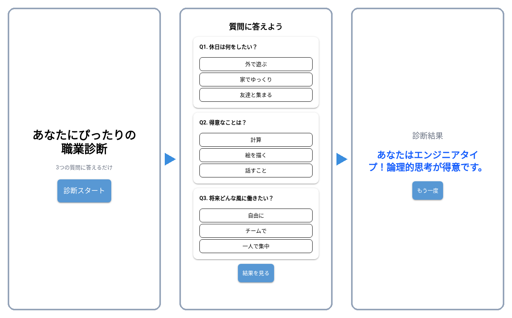
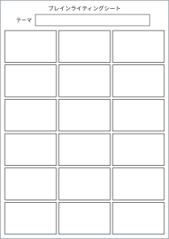

## 後期のゴール：これを自分で作る

::: {.fig width="72%"}

:::

::: {.caption-note}
質問に答えると結果が出る、Webブラウザで動く診断アプリの例
:::


## アプリの企画・設計・実装

- 最終課題は **Webアプリの企画・設計・実装**
   - 画面はPython（NiceGUI）で作成
   - データは自作APIから取得
- **発想法**で案を出し、作るものを選ぶ


## {background-color="white" .center .break-slide}

::: {.break-title}
一人で発想
:::


## **演習** ペットボトルの新しい使い方 {.badge-practice}

::: {.prompt}
**ペットボトルの新しい使い方** を、10分間でできるだけ多く書き出せ（実現できるかは問わない）。
:::

0. 紙の上端に名前と「ペットボトル」を記入
1. 相談なしで、1行に1案ずつ記入（**10分**）
2. 終了の合図で、案の個数を数えて紙の右上に記入


## **演習** ペーパークリップの新しい使い方 {.badge-practice}

::: {.prompt}
**ペーパークリップの新しい使い方** を、10分間でできるだけ多く書き出せ（実現できるかは問わない）。
:::

0. 新しい紙の上端に名前と「ペーパークリップ」を記入
1. 相談なしで、1行に1案ずつ記入（**10分**）
2. 終了の合図で、案の個数を数えて紙の右上に記入


## アイデアには量と幅がある

- 出した案は、個数だけでなく種類の数でも数えられる

| | 数えるもの | 創造性の研究での呼び名 |
|---|---|---|
| **量** | 案の個数 | **流暢性**（[fluency]{.en}） |
| **幅** | 案の種類の数 | **柔軟性**（[flexibility]{.en}） |

#### 例：ペットボトルの使い方を3案

| 3案 | 量 | 幅 |
|---|---|---|
| 花瓶・ペン立て・貯金箱 | 3 | 1（3案とも入れ物） |
| 花瓶・ダンベル・マラカス | 3 | 3（入れ物・おもり・楽器） |

::: {.caption-note}
似た使い方は同じ種類として数える（用語の定義：[Grajzel ほか 2023](https://pmc.ncbi.nlm.nih.gov/articles/PMC9889931/)）
:::


## **演習** 幅を数える {.badge-practice}

::: {.prompt}
ペットボトルとペーパークリップの2枚について、案の幅を数えよ（**5分**）。
:::

0. 似た使い方の案に同じ記号（A、B、C…）を記入
1. 使った記号の数（幅）を、紙の右上の個数（量）の隣に記入


## {background-color="white" .center .break-slide}

::: {.break-title}
発想法
:::


## 発散と収束：アイデアづくりの2段階

- アイデアづくりは ==2つのモード== を行き来する
   - **発散思考**（[divergent thinking]{.en}）：考えを **広げる**
   - **収束思考**（[convergent thinking]{.en}）：出したものを **整理して絞る**

```{.d2 sketch="true" width="100%"}
direction: right
T: テーマ {style.fill: "#fff3e0"}
D: 発散\n広げる\n量を出す {style.fill: "#e3f2fd"}
C: 収束\n整理する\n絞る {style.fill: "#e8f5e9"}
A: 実行案 {style.fill: "#fce4ec"}
T -> D: ブレスト\n635法
D -> C: KJ法\nマップ
C -> A: ペイオフ\nマトリクス
```

::: {.callout-important}
## 評価は案を出してから
発散の最中は ==評価・批判を保留== し、出た案を記録する。実現できるかどうかは、案が集まってから検討する
:::


## なぜ「量」なのか

- 最初から良い案だけを出そうとすると、思いついても書く前に却下してしまう
- まず複数の案を出し、あとで比較して選ぶ

| 方法 | 案の出し方 |
|---|---|
| ブレインストーミング | 会話の中で他の人の案から連想 |
| クレイジー8 | 時間を区切り、1分に1案ずつ記入 |
| 635法 | シートを回し、前の人の案を発展 |


::: {.takeaway .dark}
**「石を拾うことはあっても玉を捨てることなかれ」**
:::


## {background-color="white" .center .break-slide}

::: {.break-title}
ブレインストーミング
:::


## ブレインストーミング（Brainstorming）

- みんなで集まって、テーマについて **自由にアイデアを出し合う** 方法
- アメリカの広告会社の **アレックス・F・オズボーン**（Alex F. Osborn、1888–1966）が考案
   - 1953年の著書『Applied Imagination』などを通じて普及（[Buffalo State大学の解説](https://creativity.buffalostate.edu/explore-curated-collection-creative-history)）
   - オズボーンは [チェックリスト法](scamper.qmd) の生みの親でもある
- 日本では略して **ブレスト** と呼ばれる

::: {.fig-cite src="imgs/ideation/brainstorming_workshop.jpg" height="260px"}

::: {.cite}
写真: Jan Dittrich (WMDE), CC BY 4.0, via Wikimedia Commons
:::

:::


## ブレストの4つのルール

1. **批判厳禁**：出た案の評価は保留
2. **自由奔放**：常識にとらわれない案も歓迎
3. **質より量**：まず多くの案を記録
4. **便乗歓迎**：他の人の案を組み合わせ、発展

::: {.callout-tip}
## なぜ「批判厳禁」が最初のルールか
すぐに否定されると、案を口に出しにくくなる。実現が難しそうな案も、まずは記録する
:::


## ブレストの進め方

0. 司会（**ファシリテーター**、[facilitator]{.en}）がテーマを発表
1. 思いついた人から発言
2. 出た案を **すべて記録**（ホワイトボード・付箋）
3. ある程度出たら、整理・分類へ（→ 収束技法）

- 他の人の発言から、新しい案を連想できる
- 発言が一部の人に偏らないよう、司会が参加を促す


## **演習** ブレスト {.badge-practice}

::: {.prompt}
**お題：新聞紙の新しい使い方** 
:::

0. 司会を決め、4つのルールを確認（**2分**）
1. 案を付箋に書き、読み上げて机に貼る（**10分**）

::: {.callout-tip}
## 4つのルールを貼り出しておく
批判厳禁・自由奔放・質より量・便乗歓迎。案の評価が始まったら、ルールを確認する
:::


## {background-color="white" .center .break-slide}

::: {.break-title}
クレイジー8
:::


## クレイジー8（Crazy 8s）

- **1分で1案** を強制的に考え、それを **8回** くり返す発想法
   - 「クレイジー」は、この速さのこと
   - 最初に浮かんだ案で止まらず、その先の案まで出させるのがねらい（[Design Sprint Kit](https://designsprintkit.withgoogle.com/methodology/phase3-sketch/crazy-8s)）
- 話し合わず、一人ずつ紙に書く
- Google Ventures の **Jake Knapp** らがまとめた **デザインスプリント**（[Design Sprint]{.en}）の一手法
   - 書籍『Sprint』（2016）に手順が載っている


## クレイジー8の用紙

```{.d2 sketch="true" width="50%"}
grid-rows: 2
grid-columns: 4
grid-gap: 0
classes: {
  cell: {style.fill: "#e3f2fd"; style.font-size: 22; width: 110; height: 155}
}
1: 案1\n(1分) {class: cell}
2: 案2\n(1分) {class: cell}
3: 案3\n(1分) {class: cell}
4: 案4\n(1分) {class: cell}
5: 案5\n(1分) {class: cell}
6: 案6\n(1分) {class: cell}
7: 案7\n(1分) {class: cell}
8: 案8\n(1分) {class: cell}
```

::: {.takeaway}
A4を3回折ると8枠。**1枠1分・1アイデア**
:::


## クレイジー8の進め方

0. A4用紙を3回折って8つの枠を作成
1. テーマを決定（例：「輪ゴムの新しい使い方」）
2. **1分** で1案を考え、1つの枠に記入（絵や図を添えてもよい）
3. 1分経ったら次の枠へ移り、これを **8回** くり返す

::: {.callout-important}
## 1案を書き込みすぎない
1分経ったら次の案へ移る。説明の詳しさより、案の違いが分かることを優先する。短い語句だけでもよい
:::


## **演習** クレイジー8 {.badge-practice}

::: {.prompt}
**お題：割り箸の新しい使い方**
:::

0. A4用紙を3回折って8枠を作成（**1分**）
1. 1分で1案を考えて1枠に記入。合図で次の枠へ移る（**1分 × 8回**）


## {background-color="white" .center .break-slide}

::: {.break-title}
635法・ブレインライティング
:::


## 635法（ブレインライティング）

- ブレストのように話し合わず、**無言で紙に書いて回す** 発想法
   - 前の人の案を読み、そこから **連想**（[association]{.en}）した案を書き足す
- **Bernd Rohrbach** が1969年、ドイツの雑誌に「Methode 635」として発表（[川路 2024](https://www.jstage.jst.go.jp/article/japancreativity/27/0/27_53/_article/-char/ja/)）
   - 「635」（[6-3-5 Method]{.en}）は **6人・3案・5回の発展**
- のちに **ブレインライティング**（[brainwriting]{.en}）と呼ばれるようになった
   - 日本には **高橋誠** が紹介
   - 別名「沈黙のブレインストーミング」


## 635法の進め方

- 最初に各自3案を書き、シートを回して他の5人が順に発展させる
- 時間の目安は **1巡5分**。最初の記入を含めて6巡

```{.d2 sketch="true" width="72%"}
direction: right
A: 自分のシート\n案を3つ書く {style.fill: "#e3f2fd"}
B: 左隣へ回す {style.fill: "#fff3e0"}
C: 隣のシート\n前の案を見て3つ追記 {style.fill: "#e3f2fd"}
D: 6巡で終了 {style.fill: "#e8f5e9"}
A -> B: 5分
B -> C
C -> B: くり返し
B -> D
```


## 635法のワークシート

:::: {.columns .columns-v-center}

::: {.column width="40%"}

:::

::: {.column width="60%"}
- 1人が1枚持ち、3列 × 6行の枠に書く
   - 1行が1人ぶん（3案）
- 回ってきたシートには、上の行の下に書き足す

::: {.caption-note}
印刷用：[ブレインライティングシート（PDF）](imgs/ideation/bw_sheet.pdf){target="_blank"}
:::

:::

::::


## ワークシートの記入例

- お題は「ペットボトルの新しい使い方」。Aさんから回り始めたシート

| | 案1 | 案2 | 案3 |
|---|---|---|---|
| 1巡目（Aさん） | 水を入れてダンベル | 切って植木鉢 | 米を入れてマラカス |
| 2巡目（Bさん） | 砂に替えて重さを調節 | 底に穴をあけて水はけ | 中身を替えて音を変える |
| 3巡目（Cさん） | 2本つないでバーベル | つるして空中の花壇 | 大小そろえて合奏 |
| 4〜6巡目 | … | … | … |

::: {.caption-note}
**上にある他人の案を参考に**、使い方を変えたり、条件や具体例を加えたりして**発展**させる
:::


## 理論上、30分で何案出せるか


- 最初に書く案：6人 × 3案 = **18案**
- 5回の発展：18案 × 5回 = **90案**
- 合計 **108案**（1回5分で30分）


::: {.callout-note}
## 635法の5は「5分」が通説だが誤解
考案者 Bernd Rohrbach の原案は「3案 × **5回** 発展させる」だったが、のちに「**5分**」と混同されて広まった（[川路 2024](https://www.jstage.jst.go.jp/article/japancreativity/27/0/27_53/_article/-char/ja/)）
:::


## **演習** 635法 {.badge-practice}

::: {.prompt}
**お題：タオルの新しい使い方**
:::

0. シートをチーム人数分ずつ準備
1. 1巡目の行に3案を記入（**5分**）
2. 合図でシートを左隣へ回し、上の行を読んで3案を追記。チームの全員が書くまでくり返す（6人なら **5分 × 5回**）

## まとめ：3つの発想法

| 方法 | 発想のしかた | 向いている人・場面 |
|---|---|---|
| ブレインストーミング | **話しながら** 出す | 会話から連想を広げたい |
| クレイジー8 | **1分ずつ区切って** 書く | 短い時間で数を出したい／1人でもできる |
| 635法 | **無言で書いて** 回す | 発言が苦手な人がいる／全員から集めたい |

::: {.callout-tip}
## 案を出したあと
評価を保留して案を出し、[収束技法（KJ法・アイデアマップ）](convergence.qmd) で整理する
:::
