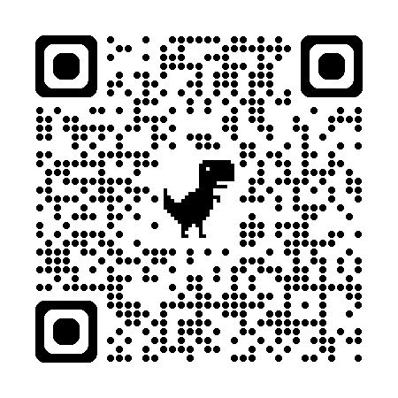

## 情報処理 2025年度

[https://rkskmt.github.io/ip3200/](https://rkskmt.github.io/ip3200/)

PCの使い方アップデート

- [キータイピング](key-typing.qmd)
- [ショートカット](shortcuts.qmd)

速習Python基礎

- [変数と代入](variables.qmd)
- [速習：コレクション](collections.qmd)
- [listあらためて](list.qmd)
- [dictあらためて](dict.qmd)

Pythonデータ処理基礎

- [NumPy入門](numpy.qmd)
- [ベクトルと行列](vector_matrix.qmd)

{fig-align="center" width=300}

