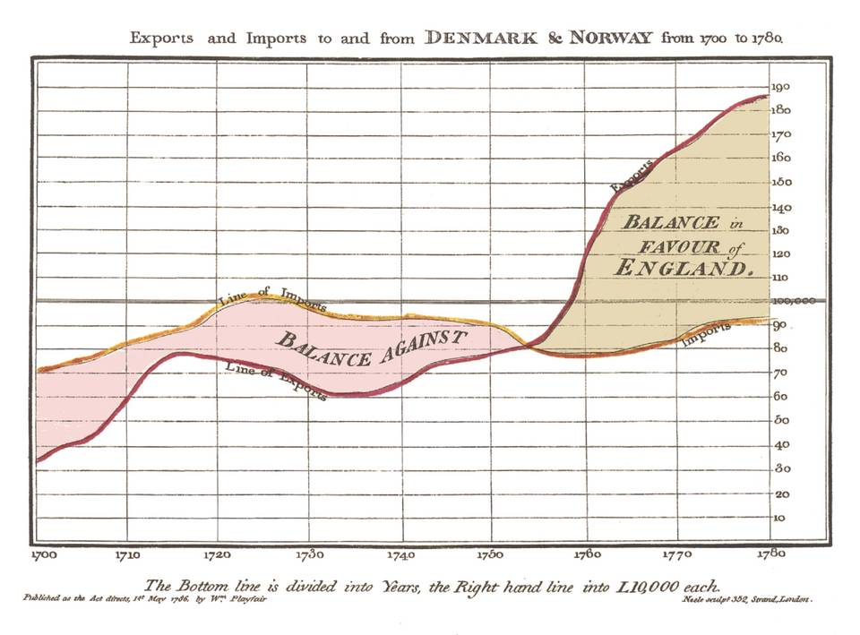
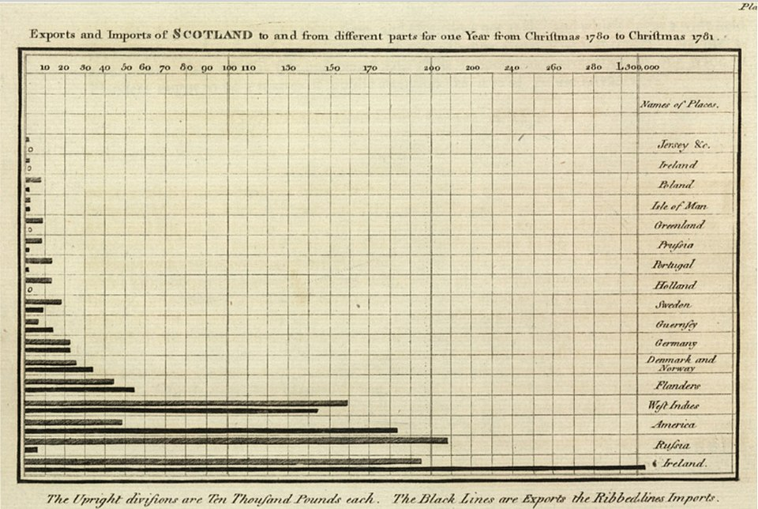

## {background-color="white" .center .break-slide}

::: {.break-title}
情報可視化とは
:::

## 情報可視化とは？

- データや情報がもつ **関係性** や **特徴** を、視覚的に見て理解できるようにすること
   - 見えないものを **「見える」化**
   - 人間の **視覚・直感・経験** で共通に扱えるようにする
- 情報視覚化ともいう
   - Information Visualization
   - Data Visualization

::: {.callout-tip}
## なぜ「見る」のか
- 数字の表を眺めても気づけないパターン（外れ値、相関、周期性、クラスタ）が見える
- **図示は最強の前処理**
:::


## 可視化の古典：ジョン・スノウのコレラ地図

- 1854年、ロンドンで原因不明の病気が大流行
   - **医師 John Snow** が原因調査をおこなう
   - 感染データを**地図にプロット**したところBroad Street の井戸の周囲に感染者が集中していることを発見
   - 「水が感染源」という**仮説を視覚で立証**
   - **疫学** という分野の出発点とされる


```{python}
#| echo: false
#| output: false
import pandas as pd
import plotly.graph_objects as go

deaths = pd.read_csv("data/cholera_deaths.csv")
pumps = pd.read_csv("data/cholera_pumps.csv")

broad_st = pumps[pumps["Pump Name"] == "Broad St."].iloc[0]

fig = go.Figure()

fig.add_trace(go.Scattermapbox(
    lat=deaths["X coordinate"], lon=deaths["Y coordinate"],
    mode="markers",
    marker=dict(size=deaths["Death"]*5, color="red", opacity=0.6),
    name="Deaths", hoverinfo="skip"
))

other_pumps = pumps[pumps["Pump Name"] != "Broad St."]
fig.add_trace(go.Scattermapbox(
    lat=other_pumps["X coordinate"], lon=other_pumps["Y coordinate"],
    mode="markers",
    marker=dict(size=10, color="gray"),
    name="Other Pumps", hoverinfo="skip"
))

fig.add_trace(go.Scattermapbox(
    lat=[broad_st["X coordinate"]], lon=[broad_st["Y coordinate"]],
    mode="markers+text",
    marker=dict(size=20, color="blue", symbol="circle"),
    text=["← Broad St. 井戸（感染源）"], textposition="middle right",
    textfont=dict(size=14, color="blue"),
    name="Broad St."
))

fig.update_layout(
    mapbox=dict(style="open-street-map",
                center=dict(lat=51.5135, lon=-0.1365), zoom=16),
    margin=dict(l=0, r=0, t=0, b=0),
    width=900, height=500, showlegend=False
)
fig.write_html("iframes/cholera_map.html", include_plotlyjs="cdn")
```

::: {.plotly-iframe src="iframes/cholera_map.html"}
:::


## 数的グラフの始祖：ウィリアム・プレイフェア

- **William Playfair**（1759–1823）はスコットランドの技師・経済学者
- 現代の **棒グラフ・折れ線グラフ・円グラフ** を ==すべて発明==
   - 1786年：*Commercial and Political Atlas* で折れ線・棒グラフを初めて使用
   - 1801年：*Statistical Breviary* で円グラフ（パイチャート）を発明

::: {.callout-note}
## スノウとプレイフェア
- **スノウ** — 視覚化で ==因果関係を発見== し、社会を変えた
- **プレイフェア** — 視覚化の ==形式そのもの== を発明した
:::


## プレイフェアの折れ線グラフ（1786）

{width="85%"}

- 時間を横軸、量を縦軸にとる — 現代の時系列グラフの原型


## プレイフェアの棒グラフ（1786）

{width="85%"}

- カテゴリ（貿易相手国）を並べて **長さで比較** — 棒グラフの誕生


## プレイフェアの円グラフ（1801）

{width="70%"}

- 全体に対する **割合を角度で表現** — 円グラフの誕生


## プレイフェアの問い：なぜ数字を図にするのか

> Making information available, for thought and memory, without the **trouble of studying** rows of figures.
>
> ── William Playfair, *Commercial and Political Atlas* (1786)

- 数字の羅列を眺める **苦労を省く** ためにグラフを描く
    - 200年以上前に「視覚化の本質」を言い当てていた

::: {.callout-note}
## 可視化の本質
「データに **適切な空間（軸）** を与えること」
:::


## 現代の可視化実例

| ジャンル | サンプル |
|---|---|
| 人口動態 | [Population Pyramids of the World](https://www.populationpyramid.net/world/2024/) |
| 未来予測ゲーム | [INED "Tomorrow's Population"](https://www.ined.fr/en/everything_about_population/population-games/tomorrow-population/) |
| 気候変動 | [#ShowYourStripes](https://showyourstripes.info/) |
| 統計バブル | [Gapminder "Wealth & Health of Nations"](https://www.gapminder.org/tools/) |
| ネットワーク | [Force-Directed Graph](https://observablehq.com/@d3/force-directed-graph) |
| 地理 + 時系列 | [NYC CitiBike](https://users.flatironinstitute.org/~kmclennan/) |
| 3D点群 | [Cesium "3D Tiles Point"](https://sandcastle.cesium.com/) |

::: {.callout-tip}
## 自分の興味で1つ開いてみる
- 動的なものほど **データ量と表現力の関係** がよく分かる
:::


## {background-color="white" .center .break-slide}

::: {.break-title}
データを扱う際の大原則
:::

## "Always plot your data first."

> **あらゆるデータは、まず最初に「見て」みる**

- 平均や分散などの **統計量だけでは騙される**
- 図にしてはじめて気づける構造がある
- データ分析の最初の一手は **常にプロット**


## 例：アンスコムの四重奏

- **F. J. Anscombe（1973）** が示した4つのデータセット
- 以下の統計量が ==4つともほぼ完全に一致== する
- でも、==図にすると完全に異なるデータ==

| 統計量 | 値 |
|---|---|
| $x$ の平均 | 9 **（完全に一致）** |
| $x$ の標本分散 | 11 **（完全に一致）** |
| $y$ の平均 | 7.50 **（小数第2位まで一致）** |
| $y$ の標本分散 | 4.122 or 4.127 **（小数第3位まで一致）** |
| $x$ と $y$ の相関係数 | 0.816 **（小数第3位まで一致）** |
| 回帰直線 | $y = 3.00 + 0.500x$ **（小数第2〜3位まで一致）** |

```{python}
#| echo: false
#| fig-align: center
import numpy as np
import matplotlib.pyplot as plt

x1 = np.array([10, 8, 13, 9, 11, 14, 6, 4, 12, 7, 5])
y1 = np.array([8.04, 6.95, 7.58, 8.81, 8.33, 9.96, 7.24, 4.26, 10.84, 4.82, 5.68])
y2 = np.array([9.14, 8.14, 8.74, 8.77, 9.26, 8.10, 6.13, 3.10, 9.13, 7.26, 4.74])
y3 = np.array([7.46, 6.77, 12.74, 7.11, 7.81, 8.84, 6.08, 5.39, 8.15, 6.42, 5.73])
x4 = np.array([8, 8, 8, 8, 8, 8, 8, 19, 8, 8, 8])
y4 = np.array([6.58, 5.76, 7.71, 8.84, 8.47, 7.04, 5.25, 12.50, 5.56, 7.91, 6.89])

fig, axes = plt.subplots(2, 2, figsize=(6, 5))
for ax, (x, y, t) in zip(axes.ravel(), [(x1, y1, "I"), (x1, y2, "II"), (x1, y3, "III"), (x4, y4, "IV")]):
    ax.scatter(x, y, color="#2266CC")
    m, b = np.polyfit(x, y, 1)
    xs = np.linspace(2, 20, 50)
    ax.plot(xs, m * xs + b, color="#CC4444", linewidth=1)
    ax.set_xlim(2, 20)
    ax.set_ylim(2, 14)
    ax.set_title(f"dataset {t}", fontsize=10)
    ax.grid(True, linestyle="--", alpha=0.5)
plt.tight_layout()
plt.show()
```


## アンスコムの四重奏 ①：普通のデータ

- ばらつきはあるが **ゆるやかに直線的に増える**
- 線形回帰の前提（直線関係 + 均一なばらつき）が成立
- 典型的な普通のデータ

```{python}
#| echo: false
#| fig-align: center
import numpy as np
import matplotlib.pyplot as plt

x = np.array([10, 8, 13, 9, 11, 14, 6, 4, 12, 7, 5])
y = np.array([8.04, 6.95, 7.58, 8.81, 8.33, 9.96, 7.24, 4.26, 10.84, 4.82, 5.68])

plt.figure(figsize=(4, 3))
plt.scatter(x, y, color="#2266CC")
m, b = np.polyfit(x, y, 1)
xs = np.linspace(2, 20, 50)
plt.plot(xs, m * xs + b, color="#CC4444", linewidth=1)
plt.xlim(2, 20); plt.ylim(2, 14)
plt.grid(True, linestyle="--", alpha=0.5)
plt.tight_layout()
plt.show()
```

```{python}
#| echo: true
#| eval: false
#| code-fold: true
#| code-summary: "コードを見る"
import numpy as np
import matplotlib.pyplot as plt

x = np.array([10, 8, 13, 9, 11, 14, 6, 4, 12, 7, 5])
y = np.array([8.04, 6.95, 7.58, 8.81, 8.33, 9.96,
              7.24, 4.26, 10.84, 4.82, 5.68])

plt.scatter(x, y)
m, b = np.polyfit(x, y, 1)        # 1次回帰
plt.plot(x, m * x + b, color="red")
plt.show()
```

::: {.callout-tip}
## 教訓
- 回帰直線が **データの要約として正しく機能**
- 4つの中で線形モデルが成立する **唯一の例**
:::


## アンスコムの四重奏 ②：曲線にフィッティング

- `y` が **滑らかな曲線**（2次関数的）を描いている
- 直線を当てはめても本質を捉えられない
- 統計量だけ見ていると「直線で説明できた」と思い込みやすい

```{python}
#| echo: false
#| fig-align: center
import numpy as np
import matplotlib.pyplot as plt

x = np.array([10, 8, 13, 9, 11, 14, 6, 4, 12, 7, 5])
y = np.array([9.14, 8.14, 8.74, 8.77, 9.26, 8.10, 6.13, 3.10, 9.13, 7.26, 4.74])

plt.figure(figsize=(4, 3))
plt.scatter(x, y, color="#2266CC")
m, b = np.polyfit(x, y, 1)
xs = np.linspace(2, 20, 50)
plt.plot(xs, m * xs + b, color="#CC4444", linewidth=1)
plt.xlim(2, 20); plt.ylim(2, 14)
plt.grid(True, linestyle="--", alpha=0.5)
plt.tight_layout()
plt.show()
```

```{python}
#| echo: true
#| eval: false
#| code-fold: true
#| code-summary: "コードを見る"
import numpy as np
import matplotlib.pyplot as plt

x = np.array([10, 8, 13, 9, 11, 14, 6, 4, 12, 7, 5])
y = np.array([9.14, 8.14, 8.74, 8.77, 9.26, 8.10,
              6.13, 3.10, 9.13, 7.26, 4.74])

plt.scatter(x, y)
m, b = np.polyfit(x, y, 1)
plt.plot(x, m * x + b, color="red")
plt.show()
```

::: {.callout-warning}
## 教訓
- そもそも **直線で表現すべきでない** データ
- 多項式回帰や対数変換などモデルを変える必要あり
- 統計量だけだと **モデル選択ミス** に気づけない
:::


## アンスコムの四重奏 ③：1つだけ外れ値

- ほぼ **完全な直線** に並んでいる
- たった1点だけ大きく外れている
- その1点に **回帰直線が引っ張られている**

```{python}
#| echo: false
#| fig-align: center
import numpy as np
import matplotlib.pyplot as plt

x = np.array([10, 8, 13, 9, 11, 14, 6, 4, 12, 7, 5])
y = np.array([7.46, 6.77, 12.74, 7.11, 7.81, 8.84, 6.08, 5.39, 8.15, 6.42, 5.73])

plt.figure(figsize=(4, 3))
plt.scatter(x, y, color="#2266CC")
m, b = np.polyfit(x, y, 1)
xs = np.linspace(2, 20, 50)
plt.plot(xs, m * xs + b, color="#CC4444", linewidth=1)
plt.xlim(2, 20); plt.ylim(2, 14)
plt.grid(True, linestyle="--", alpha=0.5)
plt.tight_layout()
plt.show()
```

```{python}
#| echo: true
#| eval: false
#| code-fold: true
#| code-summary: "コードを見る"
import numpy as np
import matplotlib.pyplot as plt

x = np.array([10, 8, 13, 9, 11, 14, 6, 4, 12, 7, 5])
y = np.array([7.46, 6.77, 12.74, 7.11, 7.81, 8.84,
              6.08, 5.39, 8.15, 6.42, 5.73])

plt.scatter(x, y)
m, b = np.polyfit(x, y, 1)
plt.plot(x, m * x + b, color="red")
plt.show()
```

::: {.callout-warning}
## 教訓
- **外れ値（outlier）** に統計量が支配される
- 入力ミスとして除外するか、本物の現象として尊重するか
- **図を見ないと判断できない**
:::


## アンスコムの四重奏 ④： 共通した値を共有したデータ

- `x` の値が **ほぼすべて 8**
- 1点だけ `x=19` にあり、その1点が「直線がある」ように見せている
- 同じ条件で測定しすぎていて、`x` が振れていない

```{python}
#| echo: false
#| fig-align: center
import numpy as np
import matplotlib.pyplot as plt

x = np.array([8, 8, 8, 8, 8, 8, 8, 19, 8, 8, 8])
y = np.array([6.58, 5.76, 7.71, 8.84, 8.47, 7.04, 5.25, 12.50, 5.56, 7.91, 6.89])

plt.figure(figsize=(4, 3))
plt.scatter(x, y, color="#2266CC")
m, b = np.polyfit(x, y, 1)
xs = np.linspace(2, 20, 50)
plt.plot(xs, m * xs + b, color="#CC4444", linewidth=1)
plt.xlim(2, 20); plt.ylim(2, 14)
plt.grid(True, linestyle="--", alpha=0.5)
plt.tight_layout()
plt.show()
```

```{python}
#| echo: true
#| eval: false
#| code-fold: true
#| code-summary: "コードを見る"
import numpy as np
import matplotlib.pyplot as plt

x = np.array([8, 8, 8, 8, 8, 8, 8, 19, 8, 8, 8])
y = np.array([6.58, 5.76, 7.71, 8.84, 8.47, 7.04,
              5.25, 12.50, 5.56, 7.91, 6.89])

plt.scatter(x, y)
m, b = np.polyfit(x, y, 1)
plt.plot(x, m * x + b, color="red")
plt.show()
```

::: {.callout-warning}
## 教訓
- **サンプリングが偏っている**
- 1点だけで「相関がある」と言っているのと同じ
- **実験計画（データの取り方）そのもの** を疑うべきケース
:::


## 4つを並べると…

| データ | 見た目 | 何が問題か |
|---|---|---|
| ① 素直 | 緩やかな散布 + 直線 | 問題なし — 線形回帰がうまく機能 |
| ② 曲線 | 2次関数的 | モデル選択が間違っている |
| ③ 外れ値 | 直線 + 1個ハズレ | 外れ値が統計量を支配 |
| ④ x偏り | 1点除いて全部同じ x | サンプリングが偏っている |

- **統計量は4つとも同じ**
- 図にしないと **絶対に気づけない**

::: {.callout-note}
## だからデータ処理=まず視覚化
**見ればわかる。見なければ見逃す。**
:::


## 探索的データ解析（EDA）

- **テューキー（Tukey）** が1977年の著書 **E**xploratory **D**ata **A**nalysis で提唱
   - 「まずデータを **見て** から仮説を立てる」という原則
   - 統計学の前段として現在も基本中の基本
- 箱ひげ図・幹葉図など、Tukeyが広めた可視化手法は多数

::: {.callout-note}
## Tukey 
**"bit"**（**bi**nary digi**t** の短縮形）や **"software"** の生みの親
:::


## グラフの種類

- まずは簡単なグラフやプロットでよい
- 目的に応じて使い分ける

| 種類 | 用途 |
|---|---|
| 散布図 | 2変量の相関 |
| 折れ線 | 時系列・連続データ |
| 棒グラフ | カテゴリ比較 |
| ヒストグラム | 分布把握 |
| 3D散布図 | 3変量関係 |


## {background-color="white" .center .break-slide}

::: {.break-title}
matplotlibでグラフを描く
:::


## matplotlib とは

- Pythonにおけるグラフ描画の **デファクトスタンダード**
   - **マットプロットリブ**と読む
- 内部はC実装で高速、NumPyの `ndarray` と相性が良い
   - seaborn や pandas の plotting 機能など、派生ライブラリも多い

ターミナルからインストール：

```shell
pip install matplotlib
```

冒頭で import（`plt` としてインポートするのが一般的）：

```python
import matplotlib.pyplot as plt
```


## まずはドキュメントを眺める（重要）

- 公式の **Plot types** ページに、描けるグラフの一覧がある
- <https://matplotlib.org/stable/plot_types/index.html>

::: {.callout-tip}
## 上達のコツ
- まず **何ができるかを頭に入れる**
- やりたい図ができたら、似たギャラリーを探してコードを真似る
- **自前でゼロから書かない** のが鉄則
:::


## 1. 点のプロット

- 一番基本の `plt.plot(x, y, 'o')` — 'o' は **マーカー** を表す
- `x` も `y` も **`ndarray`** や **`list`** でOK

```{python}
#| echo: true
import numpy as np
import matplotlib.pyplot as plt

x = np.arange(4)       # [0 1 2 3]
y = [10, 20, 5, 30]

plt.plot(x, y, 'o')    # 'o' で点だけプロット
plt.show()
```


## 2. 線のグラフ

- 第3引数を **省略すると折れ線**
- `'o-'` だと **点＋線**

```{python}
#| echo: true
import numpy as np
import matplotlib.pyplot as plt

x = np.arange(10)      # [0 ... 9]
y = x + 5

plt.plot(x, y)         # 折れ線
plt.show()
```


## 3. 表示範囲の指定（xlim / ylim）

- `plt.xlim(a, b)` / `plt.ylim(a, b)` で軸の範囲を固定
- 3次元プロットでは `zlim` も使える
- 何も指定しないと **データの範囲＋少し余白** が自動で選ばれる

```{python}
#| echo: true
import numpy as np
import matplotlib.pyplot as plt

x = np.arange(10)
y = x + 5

plt.xlim(0, 10)        # x軸: 0〜10
plt.ylim(0, 15)        # y軸: 0〜15（あえて0から見せる）
plt.plot(x, y, 'o-')
plt.show()
```

::: {.callout-warning}
## y軸の罠
- 範囲をデータに合わせると **小さな変化が大きく見える** ことがある
- 比較するグラフは **y軸を揃える** か **0から見せる** のが原則
:::


## 4. ラベル・グリッド・タイトル・凡例

- `plt.xlabel()` / `plt.ylabel()` で **軸ラベル**
- `plt.title()` で **グラフタイトル**
- `plt.legend()` で **凡例**（`plot()` に `label=` を指定しておく）
- `plt.grid(True)` で **グリッド線**

```{python}
#| echo: true
import numpy as np
import matplotlib.pyplot as plt

x = np.arange(10, 200)

y1 = x ** (1/2)
plt.plot(x, y1, 'o-', label="sqrt(x)")     # 凡例ラベル

y2 = x ** (1/3)
plt.plot(x, y2, 'o-', label="cbrt(x)")

plt.legend()                                # 凡例を表示
plt.title("1/2 vs 1/3 power")               # タイトル
plt.xlabel("x value")                       # x軸ラベル
plt.ylabel("y value")                       # y軸ラベル
plt.grid(True)                              # グリッド線
plt.show()
```

::: {.callout-tip}
## 装飾の優先順位
- **軸ラベル**（何の量か）
- **凡例**（どの線が何か）
- **タイトル**（何のグラフか）
- この3つが揃っていない図は **資料に載せてはいけない**
:::


## 5. 複数のグラフを並べる（subplot）

- `plt.subplot(行数, 列数, 場所番号)` で碁盤の目状に並べる
- 場所番号は **1始まり、左上から右へ**
- 例：`plt.subplot(2, 2, 3)` は2×2の3番目（左下）

::: {style="text-align:center; font-family:monospace;"}
1 │ 2<br>
─┼─<br>
3 │ 4
:::

```{python}
#| echo: true
import numpy as np
import matplotlib.pyplot as plt

x = np.arange(5)
y = x ** 2

plt.subplot(1, 2, 1)        # 1行2列の左
plt.plot(x, y, '-')

plt.subplot(1, 2, 2)        # 1行2列の右
plt.bar(x, y)

plt.tight_layout()          # 余白を自動調整
plt.show()
```


## 6. 二次元データの散布図

- 大量の `(x, y)` を点で打つ → 分布や相関が見える
- `alpha` で **透明度** を指定すると重なりが分かりやすい

```{python}
#| echo: true
import numpy as np
import matplotlib.pyplot as plt

# 0〜1 の一様乱数を 200点
x = np.random.rand(200)
y = np.random.rand(200)

plt.scatter(x, y, alpha=0.7)
plt.xlabel("X (0-1)")
plt.ylabel("Y (0-1)")
plt.title("2D scatter: uniform random")
plt.axis("equal")           # 縦横を同じスケールに
plt.show()
```

::: {.callout-tip}
## 重なりが多いとき
- `alpha=0.3` などで透過 → 密度が見える
- 点数が万を超えるなら **ヒートマップ** や **hexbin** を検討
:::


## 7. 三次元データの散布図

- 3D は `add_subplot(projection="3d")` で軸オブジェクトを作る
- `plt.◯◯` ではなく **`ax.◯◯`** で操作する

```{python}
#| echo: true
import numpy as np
import matplotlib.pyplot as plt

x = np.random.rand(300)
y = np.random.rand(300)
z = np.random.rand(300)

fig = plt.figure()
ax = fig.add_subplot(projection="3d")
ax.scatter(x, y, z, alpha=0.6)

ax.set_xlabel("X")
ax.set_ylabel("Y")
ax.set_zlabel("Z")
plt.show()
```

::: {.callout-note}
## なぜ 3D だけ `ax.` を使う？
- `plt.scatter()` などは **2D専用のショートカット**
- 3D軸を作るには `projection="3d"` の指定が必要で、`plt.subplot()` では対応できない
- 3D では `ax.scatter()`, `ax.set_zlabel()` など **軸オブジェクト経由** で操作する
:::

::: {.callout-tip}
## `plt.` と `ax.` の対応
| 2D（`plt.`） | 3D（`ax.`） |
|---|---|
| `plt.scatter(x, y)` | `ax.scatter(x, y, z)` |
| `plt.xlabel("X")` | `ax.set_xlabel("X")` |
| `plt.xlim(0, 10)` | `ax.set_xlim(0, 10)` |
| `plt.title("...")` | `ax.set_title("...")` |
:::

::: {.callout-warning}
## 3Dは多用しない
- 紙やスライドだと **奥行きが伝わらない** ことが多い
- インタラクティブに回せない場面では **2Dの分割表示** のほうが伝わる
:::


## plt早見表

| 操作 | コード |
|------|------|
| 点だけ | `plt.plot(x, y, 'o')` |
| 折れ線 | `plt.plot(x, y)` |
| 棒グラフ | `plt.bar(x, y)` |
| 散布図 | `plt.scatter(x, y)` |
| 軸の範囲 | `plt.xlim(a, b)` / `plt.ylim(a, b)` |
| 軸ラベル | `plt.xlabel("...")` / `plt.ylabel("...")` |
| タイトル | `plt.title("...")` |
| 凡例 | `plt.legend()`（要 `label=...`） |
| グリッド | `plt.grid(True)` |
| 並べる | `plt.subplot(行, 列, 番号)` |
| 3D散布 | `ax = fig.add_subplot(projection="3d")` |


## 演習1：二次関数を描く

- $y = x^2 - 2x + 3$ を **定義域 $-2 \leq x \leq 5$** で描け
- 手順
  1. `np.arange` または `np.linspace` で `x` を作る（線が滑らかになるように細かく）
  2. `y` を計算
  3. プロット — 折れ線でもOK
  4. **Y軸は0から見えるように** `ylim` を設定
  5. タイトルとラベルもつける

::: {.callout-tip}
## 平方完成で検算
- $y = (x - 1)^2 + 2$ なので **頂点は $(1, 2)$**
- グラフが合っているか確認
:::

```{python}
#| echo: true
#| eval: false
#| code-fold: true
#| code-summary: "解答例を見る"
import numpy as np
import matplotlib.pyplot as plt

x = np.linspace(-2, 5, 200)
y = x ** 2 - 2 * x + 3

plt.plot(x, y)
plt.scatter([1], [2], color="red", zorder=3)   # 頂点
plt.xlim(-2, 5)
plt.ylim(0, 20)                                 # 0から見せる
plt.xlabel("x")
plt.ylabel("y")
plt.title("y = x^2 - 2x + 3")
plt.grid(True)
plt.show()
```


## 演習2：アンスコムの四重奏を再現

- 手順
  1. 下のデータをコピペして使う
  2. `plt.subplot(2, 2, i)` で2×2に並べる
  3. それぞれ `scatter` でプロット
  4. `np.polyfit(x, y, 1)` で1次回帰直線を求め、`plot` で重ねる
  5. すべてのサブプロットで `xlim` / `ylim` を **揃える**

```python
import numpy as np

# データセット I, II, III（x は共通）
x1 = np.array([10, 8, 13, 9, 11, 14, 6, 4, 12, 7, 5])
y1 = np.array([8.04, 6.95, 7.58, 8.81, 8.33, 9.96, 7.24, 4.26, 10.84, 4.82, 5.68])
y2 = np.array([9.14, 8.14, 8.74, 8.77, 9.26, 8.10, 6.13, 3.10, 9.13, 7.26, 4.74])
y3 = np.array([7.46, 6.77, 12.74, 7.11, 7.81, 8.84, 6.08, 5.39, 8.15, 6.42, 5.73])

# データセット IV（x が異なる）
x4 = np.array([8, 8, 8, 8, 8, 8, 8, 19, 8, 8, 8])
y4 = np.array([6.58, 5.76, 7.71, 8.84, 8.47, 7.04, 5.25, 12.50, 5.56, 7.91, 6.89])
```

::: {.callout-note}
## なぜ軸を揃える？
- 4つのプロットを **公平に比較** するため
- 違うスケールで並べると印象操作になる
:::

```{python}
#| echo: true
#| eval: false
#| code-fold: true
#| code-summary: "解答例を見る"
import numpy as np
import matplotlib.pyplot as plt

x1 = np.array([10, 8, 13, 9, 11, 14, 6, 4, 12, 7, 5])
y1 = np.array([8.04, 6.95, 7.58, 8.81, 8.33, 9.96, 7.24, 4.26, 10.84, 4.82, 5.68])
y2 = np.array([9.14, 8.14, 8.74, 8.77, 9.26, 8.10, 6.13, 3.10, 9.13, 7.26, 4.74])
y3 = np.array([7.46, 6.77, 12.74, 7.11, 7.81, 8.84, 6.08, 5.39, 8.15, 6.42, 5.73])
x4 = np.array([8, 8, 8, 8, 8, 8, 8, 19, 8, 8, 8])
y4 = np.array([6.58, 5.76, 7.71, 8.84, 8.47, 7.04, 5.25, 12.50, 5.56, 7.91, 6.89])

datasets = [(x1, y1, "I"), (x1, y2, "II"), (x1, y3, "III"), (x4, y4, "IV")]

for i, (x, y, title) in enumerate(datasets, 1):
    plt.subplot(2, 2, i)
    plt.scatter(x, y)
    m, b = np.polyfit(x, y, 1)
    xs = np.linspace(2, 20, 50)
    plt.plot(xs, m * xs + b, color="red")
    plt.xlim(2, 20)
    plt.ylim(2, 14)
    plt.title(f"Dataset {title}")

plt.tight_layout()
plt.show()
```


## 演習3：好きな画像を表示

- matplotlib は **画像も描画できる**
- 公式チュートリアルを参考
- <https://matplotlib.org/stable/tutorials/images.html>

```python
import matplotlib.pyplot as plt
import matplotlib.image as mpimg

img = mpimg.imread("something.jpg") # 画像名。フォルダの場合はpathを指定
plt.imshow(img)
plt.axis("off")        # 軸を消す
plt.show()
```


## まとめ

- **可視化の歴史**：
   - プレイフェア — 棒・折れ線・円グラフを発明
   - スノウ — コレラ地図で因果関係を視覚的に立証
   - 現代のインタラクティブ可視化へ
- **大原則**：*Always plot your data first.* 
   - アンスコムの四重奏が示す数値の限界
- **matplotlib**：最小構造（plot/scatter/bar） 
   - 修飾（ラベル/タイトル/凡例/グリッド） 
   - 応用（subplot, 2D/3D散布）

## 参考リンク

- [Matplotlib "Pyplot Tutorial"](https://matplotlib.org/stable/tutorials/introductory/pyplot.html)
- [Matplotlib "Plot types"](https://matplotlib.org/stable/plot_types/index.html)
- *Python Data Science Handbook* — Chapter 3 Visualizations
- [Anscombe's quartet (Wikipedia)](https://ja.wikipedia.org/wiki/%E3%82%A2%E3%83%B3%E3%82%B9%E3%82%B3%E3%83%A0%E3%81%AE%E5%9B%9B%E9%87%8D%E5%A5%8F)
