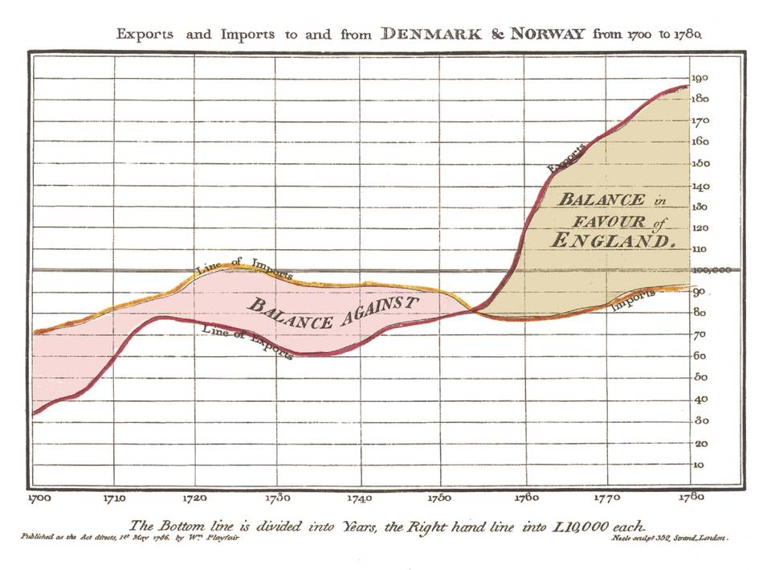
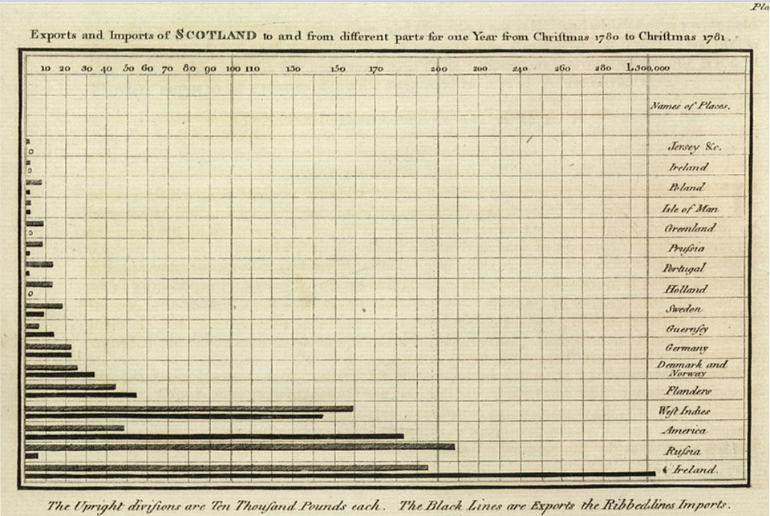

## {background-color="white" .center .break-slide}

::: {.break-title}
情報可視化とは
:::

## 情報可視化とは？

- データや情報がもつ **関係性** や **特徴** を、視覚的に見て理解できるようにすること
   - 見えないものを **「見える」化**
   - 人間の **視覚・直感・経験** で共通に扱えるようにする
- 情報視覚化ともいう
   - Information Visualization
   - Data Visualization

::: {.callout-tip}
## なぜ「見る」のか
- 数字の表を眺めても気づけないパターン（外れ値、相関、周期性、クラスタ）が見える
- **図示は最強の前処理**
:::


## 予告：この授業のゴール

- 数回後には、**世界中の人がいま何を見ているか** を自分のコードで取得して可視化できるようになる
- 例：あるWikipediaページの **2025年・1年分の閲覧数**（実データ。記事名はまだ秘密）

```{python}
#| echo: false
#| fig-align: center
import numpy as np
import matplotlib.pyplot as plt
import japanize_matplotlib

views = np.loadtxt("data/tanabata_pageviews_2025.csv", delimiter=",", skiprows=1, usecols=1)

fig, ax = plt.subplots(figsize=(7, 2.6))
ax.plot(views, color="#2266CC", linewidth=1)
ax.set_xlabel("日数（1月1日からの経過日数）")
ax.set_ylabel("閲覧数")
ax.grid(True, linestyle="--", alpha=0.5)
plt.tight_layout()
plt.show()
```

- ほぼ平坦なのに **1日だけ大きな山**（最大47,656回、ふだんの約300倍） — この日、何があった？
- 答えは **API編** で。今日はその第一歩、「描いて、見る」技術


## 可視化の古典：ジョン・スノウのコレラ地図

- 1854年、ロンドンで原因不明の病気が大流行
   - **医師 John Snow** が原因調査をおこなう
   - 感染データを**地図にプロット**したところBroad Street の井戸の周囲に感染者が集中していることを発見
   - 「水が感染源」という**仮説を視覚で立証**
   - **疫学** という分野の出発点とされる


```{python}
#| echo: false
#| output: false
import pandas as pd
import plotly.graph_objects as go

deaths = pd.read_csv("data/cholera_deaths.csv")
pumps = pd.read_csv("data/cholera_pumps.csv")

broad_st = pumps[pumps["Pump Name"] == "Broad St."].iloc[0]

fig = go.Figure()

fig.add_trace(go.Scattermapbox(
    lat=deaths["X coordinate"], lon=deaths["Y coordinate"],
    mode="markers",
    marker=dict(size=deaths["Death"]*5, color="red", opacity=0.6),
    name="Deaths", hoverinfo="skip"
))

other_pumps = pumps[pumps["Pump Name"] != "Broad St."]
fig.add_trace(go.Scattermapbox(
    lat=other_pumps["X coordinate"], lon=other_pumps["Y coordinate"],
    mode="markers",
    marker=dict(size=10, color="gray"),
    name="Other Pumps", hoverinfo="skip"
))

fig.add_trace(go.Scattermapbox(
    lat=[broad_st["X coordinate"]], lon=[broad_st["Y coordinate"]],
    mode="markers+text",
    marker=dict(size=20, color="blue", symbol="circle"),
    text=["← Broad St. 井戸（感染源）"], textposition="middle right",
    textfont=dict(size=14, color="blue"),
    name="Broad St."
))

fig.update_layout(
    mapbox=dict(style="open-street-map",
                center=dict(lat=51.5135, lon=-0.1365), zoom=16),
    margin=dict(l=0, r=0, t=0, b=0),
    width=900, height=500, showlegend=False
)
fig.write_html("iframes/cholera_map.html", include_plotlyjs="directory")
```

::: {.plotly-iframe src="iframes/cholera_map.html"}
:::


## 数的グラフの始祖：ウィリアム・プレイフェア

- **William Playfair**（1759–1823）はスコットランドの技師・経済学者
- 現代の **棒グラフ・折れ線グラフ・円グラフ** を ==すべて発明==
   - 1786年：*Commercial and Political Atlas* で折れ線・棒グラフを初めて使用
   - 1801年：*Statistical Breviary* で円グラフ（パイチャート）を発明

::: {.callout-note}
## スノウとプレイフェア
- **スノウ** — 視覚化で ==因果関係を発見== し、社会を変えた
- **プレイフェア** — 視覚化の ==形式そのもの== を発明した
:::


## プレイフェアの折れ線グラフ（1786）

{width="85%"}

- 時間を横軸、量を縦軸にとる — 現代の時系列グラフの原型


## プレイフェアの棒グラフ（1786）

{width="85%"}

- カテゴリ（貿易相手国）を並べて **長さで比較** — 棒グラフの誕生


## プレイフェアの円グラフ（1801）

{width="50%"}

- 全体に対する **割合を角度で表現** — 円グラフの誕生


## プレイフェアの問い：なぜ数字を図にするのか

> Making information available, for thought and memory, without the **trouble of studying** rows of figures.
>
> ── William Playfair, *Commercial and Political Atlas* (1786)

- 数字の羅列を眺める **苦労を省く** ためにグラフを描く
    - 200年以上前に「視覚化の本質」を言い当てていた

::: {.callout-note}
## 可視化の本質
「データに **適切な空間（軸）** を与えること」
:::


## 現代の可視化実例 {#peek-gapminder}

| ジャンル | サンプル |
|---|---|
| 人口動態 | [Population Pyramids of the World](https://www.populationpyramid.net/world/2024/) |
| 未来予測ゲーム | [INED "Tomorrow's Population"](https://www.ined.fr/en/everything_about_population/population-games/tomorrow-population/) |
| 気候変動 | [#ShowYourStripes](https://showyourstripes.info/) |
| 統計バブル | [Gapminder "Wealth & Health of Nations"](https://www.gapminder.org/tools/) |
| ネットワーク | [Force-Directed Graph](https://observablehq.com/@d3/force-directed-graph) |
| 地理 + 時系列 | [NYC CitiBike](https://users.flatironinstitute.org/~kmclennan/) |
| 3D点群 | [Cesium "3D Tiles Point"](https://sandcastle.cesium.com/) |

::: {.callout-tip}
## ミニアクティビティ
- どれか1つ開いて、**隣の人に30秒で説明** する
   - 何のデータ？ 軸は何？ 何が見えた？
- 動的なものほど **データ量と表現力の関係** がよく分かる
:::


## {background-color="white" .center .break-slide}

::: {.break-title}
データを扱う際の大原則
:::

## "Always plot your data first."

> **あらゆるデータは、まず最初に「見て」みる**

- 平均や分散などの **統計量だけでは騙される**
- 図にしてはじめて気づける構造がある
- データ分析の最初の一手は **常にプロット**


## クイズ：「平均所得 524万円」

- 厚生労働省の調査：日本の1世帯当たり **平均所得は 524万2千円**（2022年）
- では、**所得が平均以下** の世帯は全体のどれくらい？
   - 「平均」なんだから、だいたい半分（50%）……？

## 平均以下の世帯は 62.2% {#peek-income}

```{python}
#| echo: false
#| fig-align: center
#| lightbox: true
import numpy as np
import matplotlib.pyplot as plt
import japanize_matplotlib

# 厚生労働省「2023年 国民生活基礎調査の概況」図9（所得金額階級別 相対度数分布）
freq = [6.9, 14.6, 14.5, 12.9, 10.7, 8.5, 6.4, 5.8, 4.6, 3.7,
        2.6, 2.3, 1.8, 1.0, 0.8, 0.7, 0.3, 0.3, 0.3, 0.2, 1.3]
centers = np.arange(50, 2150, 100)   # 各階級の中央（2000万円以上は2050に代表させる）

plt.figure(figsize=(8, 3.6))
plt.bar(centers, freq, width=92, color="#7FB3D5", edgecolor="white")
plt.axvline(405, color="blue", linewidth=2)
plt.axvline(524.2, color="red", linewidth=2)
plt.ylim(0, 17)
plt.annotate("中央値 405万円", xy=(390, 15.8), color="blue", ha="right", fontsize=11)
plt.annotate("平均 524.2万円", xy=(545, 14.3), color="red", ha="left", fontsize=11)
plt.xlabel("所得金額（万円）")
plt.ylabel("世帯の割合（％）")
plt.title("所得金額階級別 世帯数の相対度数分布（2022年）")
plt.tight_layout()
plt.show()
```

- **平均以下の世帯は 62.2%** — 「平均」は真ん中ではない
- 真ん中の値（**中央値**）は **405万円**。平均より **119万円** も低い
   - 一部の高所得世帯が、平均を ==右に引っ張る==
- 分布を **見ないと**、「平均」という言葉の意味すら誤解する

::: {.callout-note}
## 出典
厚生労働省「2023（令和5）年 国民生活基礎調査の概況」図9
:::


## 例：アンスコムの四重奏

- **F. J. Anscombe（1973）** が作った ==4つのデータセット==
- 4つとも、以下の統計量が ==ほぼ完全に一致== する

| 統計量 | 値 |
|---|---|
| $x$ の平均 | 9 **（完全に一致）** |
| $x$ の標本分散 | 11 **（完全に一致）** |
| $y$ の平均 | 7.50 **（小数第2位まで一致）** |
| $y$ の標本分散 | 4.122 or 4.127 **（小数第3位まで一致）** |
| $x$ と $y$ の相関係数 | 0.816 **（小数第3位まで一致）** |
| 回帰直線 | $y = 3.00 + 0.500x$ **（小数第2〜3位まで一致）** |

::: {.callout-important .fragment}
## 問題：散布図にしたら、どんな形？
- 統計量がここまで揃っているなら、**4つとも似た形になるはず…だよね？**
- めくる前に **予想して手で描いてみる**
:::


## アンスコムの四重奏：普通のデータ

:::{.columns}
:::{.column width="55%"}
- ばらつきはあるが **ゆるやかに直線的に増える**
- 線形回帰の前提（直線関係 + 均一なばらつき）が成立
- 典型的な普通のデータ
:::
:::{.column width="45%"}
```{python}
#| echo: true
#| fig-align: center
#| lightbox: true
#| code-fold: true
#| code-summary: "コードを見る"

import numpy as np
import matplotlib.pyplot as plt
import japanize_matplotlib

x = np.array([10, 8, 13, 9, 11, 14, 6, 4, 12, 7, 5])
y = np.array([8.04, 6.95, 7.58, 8.81, 8.33, 9.96, 7.24, 4.26, 10.84, 4.82, 5.68])

plt.figure(figsize=(4, 3))
plt.scatter(x, y, color="#2266CC")
m, b = np.polyfit(x, y, 1)
xs = np.linspace(2, 20, 50)
plt.plot(xs, m * xs + b, color="#CC4444", linewidth=1)
plt.xlim(2, 20); plt.ylim(2, 14)
plt.grid(True, linestyle="--", alpha=0.5)
plt.tight_layout()
plt.show()
```
:::
:::


::: {.callout-tip}
## 教訓
- 回帰直線が **データの要約として正しく機能**
- 4つの中で線形モデルが成立する **唯一の例**
:::


## アンスコムの四重奏：曲線にフィッティング

:::{.columns}
:::{.column width="55%"}
- `y` が **滑らかな曲線**（2次関数的）を描いている
- 直線を当てはめても本質を捉えられない
- 統計量だけ見ていると「直線で説明できた」と思い込みやすい
:::
:::{.column width="45%"}
```{python}
#| echo: true
#| fig-align: center
#| lightbox: true
#| code-fold: true
#| code-summary: "コードを見る"

import numpy as np
import matplotlib.pyplot as plt
import japanize_matplotlib

x = np.array([10, 8, 13, 9, 11, 14, 6, 4, 12, 7, 5])
y = np.array([9.14, 8.14, 8.74, 8.77, 9.26, 8.10, 6.13, 3.10, 9.13, 7.26, 4.74])

plt.figure(figsize=(4, 3))
plt.scatter(x, y, color="#2266CC")
m, b = np.polyfit(x, y, 1)
xs = np.linspace(2, 20, 50)
plt.plot(xs, m * xs + b, color="#CC4444", linewidth=1)
plt.xlim(2, 20); plt.ylim(2, 14)
plt.grid(True, linestyle="--", alpha=0.5)
plt.tight_layout()
plt.show()
```
:::
:::

::: {.callout-warning}
## 教訓
- そもそも **直線で表現すべきでない** データ
- 多項式回帰や対数変換などモデルを変える必要あり
- 統計量だけだと **モデル選択ミス** に気づけない
:::


## アンスコムの四重奏：外れ値が目立つデータ

:::{.columns}
:::{.column width="55%"}
- ほぼ **完全な直線** に並んでいる
- たった1点だけ大きく外れている
- その1点に **回帰直線が引っ張られている**
:::
:::{.column width="45%"}
```{python}
#| echo: true
#| fig-align: center
#| lightbox: true
#| code-fold: true
#| code-summary: "コードを見る"

import numpy as np
import matplotlib.pyplot as plt
import japanize_matplotlib

x = np.array([10, 8, 13, 9, 11, 14, 6, 4, 12, 7, 5])
y = np.array([7.46, 6.77, 12.74, 7.11, 7.81, 8.84, 6.08, 5.39, 8.15, 6.42, 5.73])

plt.figure(figsize=(4, 3))
plt.scatter(x, y, color="#2266CC")
m, b = np.polyfit(x, y, 1)
xs = np.linspace(2, 20, 50)
plt.plot(xs, m * xs + b, color="#CC4444", linewidth=1)
plt.xlim(2, 20); plt.ylim(2, 14)
plt.grid(True, linestyle="--", alpha=0.5)
plt.tight_layout()
plt.show()
```
:::
:::

::: {.callout-warning}
## 教訓
- **外れ値（[outlier]{.en}）** に統計量が支配される
- 入力ミスとして除外するか、本物の現象として尊重するか
- **図を見ないと判断できない**
:::


## アンスコムの四重奏：共通した値を共有したデータ

:::{.columns}
:::{.column width="55%"}
- `x` の値が **ほぼすべて 8**
- 1点だけ `x=19` にあり、その1点が「直線がある」ように見せている
- 同じ条件で測定しすぎていて、`x` が振れていない
:::
:::{.column width="45%"}
```{python}
#| echo: true
#| fig-align: center
#| lightbox: true
#| code-fold: true
#| code-summary: "コードを見る"

import numpy as np
import matplotlib.pyplot as plt
import japanize_matplotlib

x = np.array([8, 8, 8, 8, 8, 8, 8, 19, 8, 8, 8])
y = np.array([6.58, 5.76, 7.71, 8.84, 8.47, 7.04, 5.25, 12.50, 5.56, 7.91, 6.89])

plt.figure(figsize=(4, 3))
plt.scatter(x, y, color="#2266CC")
m, b = np.polyfit(x, y, 1)
xs = np.linspace(2, 20, 50)
plt.plot(xs, m * xs + b, color="#CC4444", linewidth=1)
plt.xlim(2, 20); plt.ylim(2, 14)
plt.grid(True, linestyle="--", alpha=0.5)
plt.tight_layout()
plt.show()
```
:::
:::

::: {.callout-warning}
## 教訓
- **サンプリングが偏っている**
- 1点だけで「相関がある」と言っているのと同じ
- **実験計画（データの取り方）そのもの** を疑うべきケース
:::


## 四重奏を並べると…

:::{.columns}
:::{.column width="45%"}

```{python}
#| echo: false
#| fig-align: center
#| lightbox: true
import numpy as np
import matplotlib.pyplot as plt
import japanize_matplotlib

x1 = np.array([10, 8, 13, 9, 11, 14, 6, 4, 12, 7, 5])
y1 = np.array([8.04, 6.95, 7.58, 8.81, 8.33, 9.96, 7.24, 4.26, 10.84, 4.82, 5.68])
y2 = np.array([9.14, 8.14, 8.74, 8.77, 9.26, 8.10, 6.13, 3.10, 9.13, 7.26, 4.74])
y3 = np.array([7.46, 6.77, 12.74, 7.11, 7.81, 8.84, 6.08, 5.39, 8.15, 6.42, 5.73])
x4 = np.array([8, 8, 8, 8, 8, 8, 8, 19, 8, 8, 8])
y4 = np.array([6.58, 5.76, 7.71, 8.84, 8.47, 7.04, 5.25, 12.50, 5.56, 7.91, 6.89])

fig, axes = plt.subplots(2, 2, figsize=(6, 5))
for ax, (x, y, t) in zip(axes.ravel(), [(x1, y1, "I"), (x1, y2, "II"), (x1, y3, "III"), (x4, y4, "IV")]):
    ax.scatter(x, y, color="#2266CC")
    m, b = np.polyfit(x, y, 1)
    xs = np.linspace(2, 20, 50)
    ax.plot(xs, m * xs + b, color="#CC4444", linewidth=1)
    ax.set_xlim(2, 20)
    ax.set_ylim(2, 14)
    ax.set_title(f"dataset {t}", fontsize=10)
    ax.grid(True, linestyle="--", alpha=0.5)
plt.tight_layout()
plt.show()
```

:::
:::{.column width="55%"}

| データ | 見た目 | 何が問題か |
|---|---|---|
| ① 素直 | 緩やかな散布 + 直線 | 線形回帰がうまく機能 |
| ② 曲線 | 2次関数的 | モデル選択が間違い |
| ③ 外れ値 | 直線 + 1個ハズレ | 外れ値が統計量を支配 |
| ④ x偏り | ほぼ全部同じ x | サンプリングが偏っている |

- **統計量は4つとも同じ**
- 図にしないと **絶対に気づけない**

:::
:::

::: {.callout-note}
## だからデータ処理=まず視覚化
**見ればわかる。見なければ見逃す。**
:::


## 現代版アンスコム：Datasaurus Dozen

- **Matejka & Fitzmaurice（2017）** が作った ==13個== のデータセット
- どれも以下の統計量が一致（小数第2位まで）

:::{.columns}
:::{.column width="50%"}

| 統計量 | 13個すべてで |
|---|---|
| $x$ の平均 | 54.26 |
| $y$ の平均 | 47.83 |
| $x$ の標準偏差 | 16.76 |
| $y$ の標準偏差 | 26.93 |
| 相関係数 | $-0.06$ |

そのうちの1つを散布図にすると…

:::
:::{.column width="50%"}

::: {.fragment}
```{python}
#| echo: false
#| fig-align: center
#| lightbox: true
import numpy as np
import matplotlib.pyplot as plt
import japanize_matplotlib

data = np.loadtxt("data/datasaurus_dino.csv", delimiter=",", skiprows=1)
plt.figure(figsize=(4.5, 4))
plt.scatter(data[:, 0], data[:, 1], color="#2266CC", s=18)
plt.xlim(0, 105)
plt.ylim(-5, 105)
plt.tight_layout()
plt.show()
```
:::

:::
:::


## Datasaurus Dozen：全13個 {#peek-datasaurus}

```{python}
#| echo: false
#| fig-align: center
#| lightbox: true
import csv
import matplotlib.pyplot as plt
import japanize_matplotlib

groups = {}
with open("data/datasaurus_dozen.tsv") as f:
    reader = csv.reader(f, delimiter="\t")
    next(reader)
    for name, x, y in reader:
        groups.setdefault(name, []).append((float(x), float(y)))

fig, axes = plt.subplots(2, 7, figsize=(13, 4))
order = ["dino", "away", "bullseye", "circle", "dots", "h_lines", "high_lines",
         "slant_down", "slant_up", "star", "v_lines", "wide_lines", "x_shape"]
for ax, name in zip(axes.ravel(), order):
    pts = groups[name]
    ax.scatter([p[0] for p in pts], [p[1] for p in pts], s=4, color="#2266CC")
    ax.set_xlim(0, 105)
    ax.set_ylim(-5, 105)
    ax.set_xticks([])
    ax.set_yticks([])
    ax.set_title(name, fontsize=8)
axes.ravel()[-1].axis("off")
plt.tight_layout()
plt.show()
```

- 13個全部、**同じ平均・同じ標準偏差・同じ相関係数**
- 教訓はアンスコムと同じ — ただし ==より強烈に==
- 出典：[Same Stats, Different Graphs (Autodesk Research)](https://www.research.autodesk.com/publications/same-stats-different-graphs/)

::: {.callout-tip}
## 作り方も面白い
- 恐竜の形を保ったまま、統計量が変わらないように点を少しずつ動かして生成
- 「統計量は強い要約だが、**形の情報はほぼ捨てている**」ことの証明
:::


## {background-color="white" .center .break-slide}

::: {.break-title}
グラフはウソをつく
:::

## ここまでは「描く側」の話

- アンスコムの教訓：**描かないと、騙される**
- もう一つの現実：**描き方しだいで、人を騙せる**
   - ニュース・広告・プレゼンで毎日使われているテクニック
- ここからは ==騙されない側== になる練習
   - ルール：これから見せるグラフに **ウソのデータは1つもない**

## クイズ：どちらの商品が売れている？

```{python}
#| echo: false
#| fig-align: center
import matplotlib.pyplot as plt
import japanize_matplotlib

plt.figure(figsize=(5, 3.5))
plt.bar(["商品A", "商品B"], [1052, 1075], color=["#888888", "#CC4444"])
plt.ylim(1040, 1080)
plt.ylabel("売上（個）")
plt.title("今月の売上比較")
plt.tight_layout()
plt.show()
```

- 商品Bの圧勝に見える
- でも、**何かおかしい。どこ？**

## 種明かし：y軸の切断 {#peek-ycut}

```{python}
#| echo: false
#| fig-align: center
import matplotlib.pyplot as plt
import japanize_matplotlib

fig, axes = plt.subplots(1, 2, figsize=(8, 3.5))
axes[0].bar(["商品A", "商品B"], [1052, 1075], color=["#888888", "#CC4444"])
axes[0].set_ylim(1040, 1080)
axes[0].set_title("さっきの図（軸: 1040〜1080）")
axes[1].bar(["商品A", "商品B"], [1052, 1075], color=["#888888", "#CC4444"])
axes[1].set_ylim(0, 1200)
axes[1].set_title("0から描いた図")
for ax in axes:
    ax.set_ylabel("売上（個）")
plt.tight_layout()
plt.show()
```

::: {.callout-warning}
## 棒グラフは「長さ」で比較するグラフ
- 実際の差は **約2%**。軸を切ると何倍にも見える
- 棒グラフは **0から描く** のが原則
- 軸の数字を確認するクセをつける
:::

## クイズ：東京は寒冷化している？

```{python}
#| echo: false
#| fig-align: center
import numpy as np
import matplotlib.pyplot as plt
import japanize_matplotlib

data = np.loadtxt("data/tokyo_temp_annual.csv", delimiter=",", skiprows=1)
year, temp = data[:, 0], data[:, 1]
mask = (year >= 2006) & (year <= 2017)

plt.figure(figsize=(6, 3.5))
plt.plot(year[mask], temp[mask], 'o-', color="#2266CC")
m, b = np.polyfit(year[mask], temp[mask], 1)
plt.plot(year[mask], m * year[mask] + b, color="#CC4444", linewidth=2)
plt.xlabel("年")
plt.ylabel("年平均気温（℃）")
plt.title("東京の年平均気温（2006〜2017）")
plt.grid(True, linestyle="--", alpha=0.5)
plt.tight_layout()
plt.show()
```

- **気象庁の実測データ**（ウソのデータは1つもない）
- 12年間で気温は下降トレンド。「温暖化はウソだった」？
- **どう反論する？**

## 種明かし：期間のチェリーピック

```{python}
#| echo: false
#| fig-align: center
#| lightbox: true
import numpy as np
import matplotlib.pyplot as plt
import japanize_matplotlib

data = np.loadtxt("data/tokyo_temp_annual.csv", delimiter=",", skiprows=1)
year, temp = data[:, 0], data[:, 1]

plt.figure(figsize=(8, 3.5))
plt.plot(year, temp, color="#2266CC", linewidth=1)
plt.axvspan(2006, 2017, color="#CC4444", alpha=0.2)
plt.annotate("さっき見せた範囲", xy=(2011, 14.0), color="#CC4444", ha="center")
plt.xlabel("年")
plt.ylabel("年平均気温（℃）")
plt.title("東京の年平均気温（1876〜2025）")
plt.grid(True, linestyle="--", alpha=0.5)
plt.tight_layout()
plt.show()
```

::: {.callout-warning}
## データが本物でも、切り取りでウソがつける
- 150年で見れば気温は **約4℃上昇**（都市化の影響も大きい）
- 揺らぎのある時系列は、**都合のいい12年** を選べば逆向きに見せられる
- 「**どの範囲を見せるか**」も作為のうち — 全体を確認するクセをつける
:::

::: {.callout-note}
## このデータは次回もう一度使う
東京の気温、**自分の手で** 描いて確かめる
:::


## 探索的データ解析（EDA）

- **テューキー（Tukey）** が1977年の著書 **E**xploratory **D**ata **A**nalysis で提唱
   - 「まずデータを **見て** から仮説を立てる」という原則
   - 統計学の前段として現在も基本中の基本
- 箱ひげ図・幹葉図など、Tukeyが広めた可視化手法は多数

::: {.callout-note}
## Tukey 
**"bit"**（**bi**nary digi**t** の短縮形）や **"software"** の生みの親
:::


## グラフの種類

- まずは簡単なグラフやプロットでよい
- 目的に応じて使い分ける

| 種類 | 用途 |
|---|---|
| 散布図 | 2変量の相関 |
| 折れ線 | 時系列・連続データ |
| 棒グラフ | カテゴリ比較 |
| ヒストグラム | 分布把握 |
| 3D散布図 | 3変量関係（回せる **Plotly回** で扱う） |


## まとめ

- **可視化の歴史**：
   - プレイフェア — 棒・折れ線・円グラフを発明
   - スノウ — コレラ地図で因果関係を視覚的に立証
- **大原則**：*Always plot your data first.*
   - 平均所得524万円 ≠ 真ん中（中央値405万円）
   - アンスコム・Datasaurus — 統計量は形を捨てている
- **グラフはウソをつく**：y軸切断・期間チェリーピック — 騙されない側になる
- **冒頭の謎**（1日だけの大きな山）は **API編で回収する**


## 次回予告

- 今日は「見る」「見抜く」 — ==読む側== の話だけだった
- 次回は ==描く側== へ：**matplotlib** を使う
   - クイズに出た **東京の気温** を、自分の手で描いて確かめる
   - 1枚のグラフを「資料に載せられるレベル」まで **育てる**


## 参考リンク

- [Anscombe's quartet (Wikipedia)](https://ja.wikipedia.org/wiki/%E3%82%A2%E3%83%B3%E3%82%B9%E3%82%B3%E3%83%A0%E3%81%AE%E5%9B%9B%E9%87%8D%E5%A5%8F)
- [Same Stats, Different Graphs — Datasaurus Dozen (Autodesk Research)](https://www.research.autodesk.com/publications/same-stats-different-graphs/)
- [厚生労働省「国民生活基礎調査」](https://www.mhlw.go.jp/toukei/list/20-21.html)
- [気象庁「過去の気象データ検索」](https://www.data.jma.go.jp/obd/stats/etrn/)
